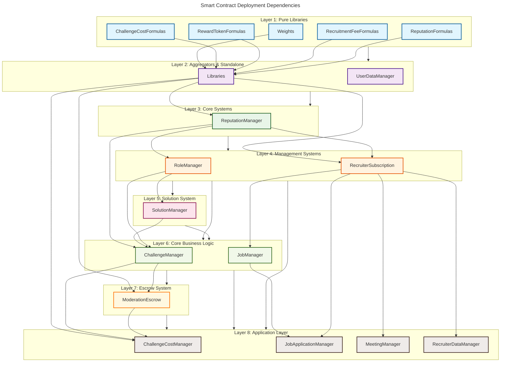

# Smart Contract Deployment Order

## Overview

This document explains the optimized deployment order for the SkillChain smart contracts to avoid nonce conflicts and dependency issues, especially on slower networks like Polygon Amoy testnet.

## Dependency Analysis

The contracts have been analyzed and organized into deployment layers based on their dependencies:

### Layer 1: Pure Libraries (No Dependencies)
- `Weights.ts` - Mathematical weights library
- `ChallengeCostFormulas.ts` - Challenge cost calculation formulas  
- `RewardTokenFormulas.ts` - Reward token calculation formulas
- `RecruitmentFeeFormulas.ts` - Recruitment fee calculation formulas
- `ReputationFormulas.ts` - Reputation calculation formulas

### Layer 2: Library Aggregator and Standalone Contracts
- `Libraries.ts` - Aggregates all formula libraries
- `UserDataManager.ts` - Standalone user data management (no dependencies)

### Layer 3: Core Reputation System
- `ReputationManager.ts` - Core reputation management (depends on Libraries)

### Layer 4: Role Management and Recruiter System
- `RoleManager.ts` - Role-based access control (depends on ReputationManager)
- `RecruiterSubscription.ts` - Recruiter subscription management (depends on ReputationManager + Libraries)

### Layer 5: Solution Management
- `SolutionManager.ts` - Solution submission and validation (depends on RoleManager)

### Layer 6: Challenge and Job Management
- `ChallengeManager.ts` - Challenge lifecycle management (depends on ReputationManager, SolutionManager, RoleManager)
- `JobManager.ts` - Job posting and management (depends on RecruiterSubscription)

### Layer 7: Escrow System
- `ModerationEscrow.ts` - Moderation and payment escrow (depends on ChallengeManager + Libraries)

### Layer 8: Final Dependent Contracts
- `ChallengeCostManager.ts` - Challenge cost management (depends on ChallengeManager, ModerationEscrow + Libraries)
- `JobApplicationManager.ts` - Job application processing (depends on JobManager, RecruiterSubscription)
- `MeetingManager.ts` - Meeting scheduling (depends on RecruiterSubscription)
- `RecruiterDataManager.ts` - Recruiter data management (depends on RecruiterSubscription)

## Deployment Order Visualization



## Key Improvements

### 1. **Dependency-Based Ordering**
- Contracts are deployed in dependency order to ensure all required contracts exist before dependent ones are deployed
- Prevents deployment failures due to missing contract addresses

### 2. **Optimized Batching**
- **Amoy Network**: 2 contracts per batch with 3-second delays between deployments
- **Other Networks**: 5 contracts per batch for faster deployment
- 5-second delays between batches on Amoy for nonce stability

### 3. **Enhanced Error Handling**
- Automatic nonce checking and retry logic for Amoy network
- Graceful failure handling that allows other contracts to continue deploying
- Detailed deployment progress and timing information

### 4. **Validation System**
- Pre-deployment validation of dependency order
- Automatic detection of missing dependencies
- Clear error messages for dependency violations

## Network-Specific Configurations

### Amoy Testnet (Chain ID: 80002)
- **Batch Size**: 2 contracts
- **Deployment Delay**: 3 seconds between contracts
- **Batch Delay**: 5 seconds between batches  
- **Retry Logic**: Enabled with nonce checking
- **Recommended for**: Production deployments to testnet

### Localhost (Chain ID: 31337)
- **Batch Size**: 5 contracts
- **Deployment Delay**: None
- **Batch Delay**: None
- **Retry Logic**: Disabled
- **Recommended for**: Development and testing

## Usage

The optimized deployment can be run using:

```bash
# Deploy to Amoy testnet
NETWORK=amoy CHAIN_ID=80002 npm run deploy

# Deploy to localhost
NETWORK=localhost CHAIN_ID=31337 npm run deploy

# Generate config only (skip deployment)
npm run deploy -- --generate-only
```

## Benefits

1. **Reduced Nonce Conflicts**: Sequential deployment with proper delays
2. **Faster Deployments**: Optimized batching reduces total deployment time
3. **Better Reliability**: Dependency validation and retry logic
4. **Clear Progress Tracking**: Detailed logging of deployment progress
5. **Network Agnostic**: Automatically adjusts parameters based on target network

This optimized approach significantly improves deployment success rates, especially on slower networks like Polygon Amoy testnet.
